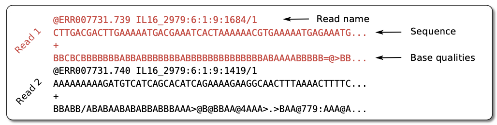
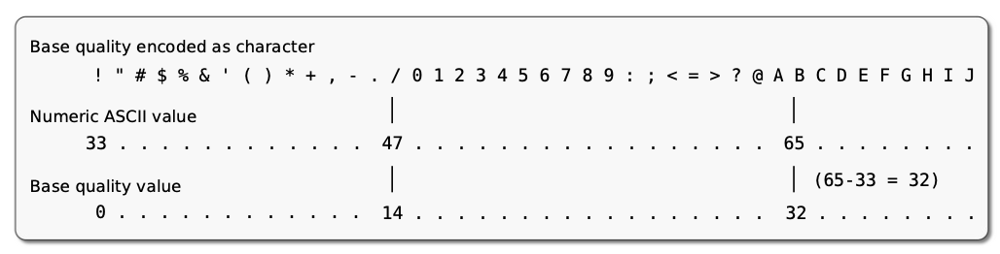
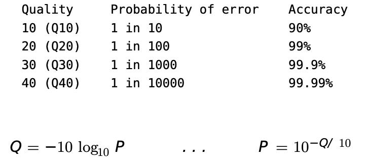

FASTQ format

-   Simple format for raw unaligned sequencing reads

<!-- -->

-   Paired-end sequencing: two FASTQ files or one interleaved file

-   

Quality encoded in ASCII characters with decimal

ASCII code of “A” is 65, the corresponding quality is Q = 65− 33 = 32

Quality = Phred-scaled probability of an error

{width="411"}
